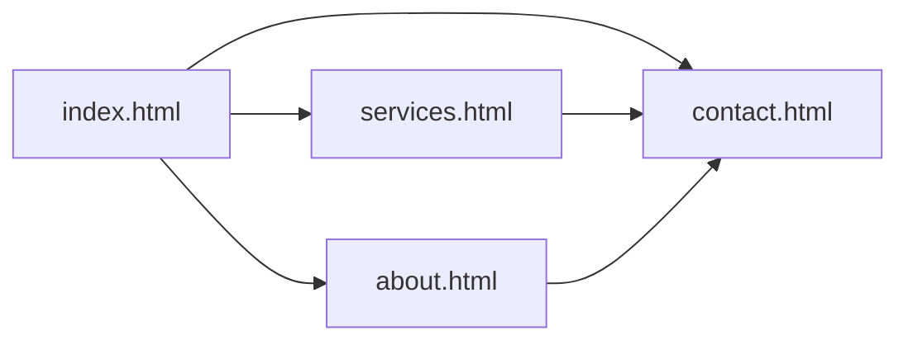

# 📚 Kasi Excellence Tutoring

> **Township tutoring that builds the next generation of South African STEM champions.**

A modern, mobile-first marketing website for **Kasi Excellence Tutoring** — a community-based tutoring service in Soweto, South Africa. The site showcases CAPS-aligned programmes in Mathematics, Physical Sciences, and Accounting, with transparent pricing and direct WhatsApp contact for learners from Grade 8 through Matric and Adult Basic Education (ABE).

---

## 📋 Table of Contents

- [Features Overview](#-features-overview)
- [Tech Stack](#-tech-stack)
- [Getting Started](#-getting-started)
  - [Prerequisites](#prerequisites)
  - [Installation](#installation)
  - [Configuration](#configuration)
- [Usage Guide](#-usage-guide)
- [Project Architecture](#-project-architecture)
- [Troubleshooting](#-troubleshooting)
- [Contributing](#-contributing)
- [License](#-license)

---

## ✨ Features Overview

| Feature | Description |
|--------|-------------|
| 🏠 **Multi-page layout** | Dedicated pages for Home, Our Story, Tutoring Subjects, and Contact |
| 📱 **Responsive design** | Mobile-first layout with a CSS-only hamburger navigation (no JavaScript required) |
| 🎓 **CAPS-aligned content** | Curriculum-focused copy for South African Grade 8–12 and ABE learners |
| 📐 **Subject showcase** | Detailed service pages for Mathematics, Physical Sciences, and Accounting |
| 💰 **Transparent pricing** | Published hourly, monthly, intensive, and group session rates (ZAR) |
| 💬 **WhatsApp-first contact** | Prominent CTAs and deep links for fast parent/learner communication |
| 📧 **Inquiry form** | Client-side contact form with subject selection and validation attributes |
| 🗺️ **Location embed** | Google Maps iframe for the Soweto service area |
| 🎨 **Branded UI** | Navy-and-gold design system using CSS custom properties |
| ⚡ **Zero build step** | Pure HTML/CSS — deploy anywhere static files are supported |

---

## 🛠 Tech Stack

### Languages & Markup

| Technology | Role |
|------------|------|
| **HTML5** | Semantic structure, forms, and multi-page routing |
| **CSS3** | Layout, theming, animations, and responsive breakpoints |

### Styling & Assets

| Technology | Role |
|------------|------|
| **CSS Custom Properties** | Centralised colour, typography, and spacing tokens in `css/styles.css` |
| **Flexbox & CSS Grid** | Responsive layouts for hero, cards, and footer grids |
| **Google Fonts** | Roboto (linked in HTML) |
| **Boxicons** | Icon font loaded via CDN (`unpkg.com`) |

### External Services (CDN / Embed)

| Service | Usage |
|---------|--------|
| **Google Maps Embed API** | Soweto location map on the Contact page |
| **WhatsApp (`wa.me`)** | Click-to-chat links across the site |
| **`mailto:`** | Email inquiries to `hello@kasiexcellence.co.za` |

### Development & Deployment

| Tool | Role |
|------|------|
| **Git** | Version control |
| **Python / Node.js / VS Code Live Server** | Optional local static file serving |
| **GitHub Pages / Netlify / Vercel** | Recommended static hosting targets |

> **Note:** This project has **no backend**, **no package manager at the repository root**, and **no JavaScript framework**. All interactivity is handled with HTML, CSS, and external links.

---

## 🚀 Getting Started

### Prerequisites

Before you begin, ensure the following are available on your machine:

| Requirement | Minimum Version | Purpose |
|-------------|-----------------|---------|
| **Git** | 2.x+ | Clone and manage the repository |
| **Modern web browser** | Latest Chrome, Firefox, Safari, or Edge | Preview and test the site |
| **Local HTTP server** *(recommended)* | Any of the options below | Avoid broken absolute paths and CORS issues when testing |

**Optional — choose one local server:**

- **Python 3** — built-in `http.server` module
- **Node.js** — `npx serve` or similar static server
- **VS Code** — [Live Server](https://marketplace.visualstudio.com/items?itemName=ritwickdey.LiveServer) extension

You do **not** need Node.js, npm, Docker, or a database to run this project.

---

### Installation

#### 1. Clone the repository

```bash
git clone https://github.com/ThamiRoneo/kasi-excellence-tutoring.git
cd kasi-excellence-tutoring
```

#### 2. Verify the project structure

```bash
ls -la
# Expected: index.html  about.html  services.html  contact.html  css/  images/
```

#### 3. *(Optional)* No dependency installation required

This is a static site. Open the files directly or serve them with a local HTTP server (see [Usage Guide](#-usage-guide)).

---

### Configuration

There is **no `.env` file** — configuration is done by editing HTML source values.

| Setting | Where to update | Example |
|---------|-----------------|---------|
| **WhatsApp number** | Search all `.html` files for `wa.me/` | `https://wa.me/27784320007` |
| **Display phone** | `contact.html` — contact item value | `+27 78 432 0007` |
| **Email address** | `mailto:` links and footer | `hello@kasiexcellence.co.za` |
| **Operating hours** | `contact.html`, `index.html` footer | Mon–Fri: 14:00–20:00 |
| **Pricing (ZAR)** | `services.html` — `.pricing-table` | Hourly: R 170.00 |
| **Google Maps embed** | `contact.html` — `<iframe src="...">` | Soweto coordinates |
| **Images** | `images/` directory | Replace `1-1.jpg`, `1-3.jpg`, `ke-logo.jpg` |

**Quick find-and-replace for WhatsApp links:**

```bash
# From the project root — preview matches first
grep -rn "wa.me" .
```

> ⚠️ **Production checklist:** Replace placeholder values such as `https://wa.me/27000000000` with your real business number before deploying.

---

## 📖 Usage Guide

### Run locally with a development server

Serving over `http://` ensures navigation links like `/index.html` resolve correctly.

#### Option A — Python 3

```bash
# From the project root
python -m http.server 8000
```

Open [http://localhost:8000](http://localhost:8000) in your browser.

#### Option B — Node.js (`npx`, no install)

```bash
npx --yes serve . -l 3000
```

Open [http://localhost:3000](http://localhost:3000).

#### Option C — VS Code Live Server

1. Open the project folder in VS Code.
2. Right-click `index.html` → **Open with Live Server**.
3. The browser opens automatically with live reload.

---

### Navigate the site

| Page | File | URL (local server) |
|------|------|-------------------|
| Home | `index.html` | `/` or `/index.html` |
| Our Story | `about.html` | `/about.html` |
| Tutoring Subjects | `services.html` | `/services.html` |
| Get in Touch | `contact.html` | `/contact.html` |

**Deep links on the Services page:**

```text
/services.html#svc-maths
/services.html#svc-sciences
/services.html#svc-accounting
/services.html#svc-pricing
```

---

### Deploy to production (static hosting)

**GitHub Pages example:**

1. Push the repository to GitHub.
2. Go to **Settings → Pages**.
3. Set **Source** to `main` branch, `/ (root)` folder.
4. Save — your site will be available at `https://<username>.github.io/kasi-excellence-tutoring/`.

**Netlify / Vercel:**

- Build command: *(none)*
- Publish directory: `/` (repository root)

---

### Customise styles

Global design tokens live in `css/styles.css`:

```css
:root {
    --navy: #0D1B2A;
    --gold: #C9900A;
    --cream: #F7F3EE;
    --green-wa: #25D366;
    /* ... */
}
```

Edit these variables to retheme the entire site without touching individual components.

---

## 🏗 Project Architecture

```text
kasi-excellence-tutoring/
│
├── index.html              # Home — hero, trust bar, subject cards, CTA
├── about.html              # Mission, story, values, about CTA
├── services.html           # Subject details, CAPS notes, pricing table
├── contact.html            # WhatsApp strip, contact info, inquiry form, map
│
├── css/
│   └── styles.css          # Global reset, variables, layout, components
│
├── images/
│   ├── 1-1.jpg             # Hero image (home)
│   ├── 1-3.jpg             # About section image
│   └── ke-logo.jpg         # Brand logo asset
│
├── .gitignore              # Ignores IDE folders (.idea/, .vscode/)
└── README.md               # Project documentation (this file)
```

### Page responsibilities



| Layer | Responsibility |
|-------|----------------|
| **HTML** | Content structure, navigation, forms, external embeds |
| **CSS** | Responsive layout, sticky nav, hamburger toggle (`#menu-toggle`), theming |
| **Images** | Photography and brand assets |
| **CDN** | Boxicons, Google Fonts, Maps embed |

### Key CSS patterns

- **Sticky navigation** — `.site-nav` with `position: sticky`
- **Mobile menu** — Checkbox hack (`#menu-toggle`) — no JavaScript
- **Smooth scrolling** — `html { scroll-behavior: smooth; }` for anchor chips on Services
- **Responsive breakpoints** — Desktop nav from `768px` via `@media` queries

---

## 🔧 Troubleshooting

### FAQ

<details>
<summary><strong>Navigation links return 404 or open as <code>file://</code></strong></summary>

**Cause:** Opening `index.html` directly in the browser uses the `file://` protocol; absolute paths like `/index.html` may not resolve.

**Fix:** Always preview via a local HTTP server (Python, `npx serve`, or Live Server). See [Usage Guide](#run-locally-with-a-development-server).
</details>

<details>
<summary><strong>Styles or fonts do not load</strong></summary>

**Cause:** Offline environment or blocked CDN requests.

**Fix:**
- Ensure you have an internet connection (Boxicons and Google Fonts load from CDN).
- Check the browser DevTools **Network** tab for failed requests.
- Verify `css/styles.css` path: `<link rel="stylesheet" href="css/styles.css">`.
</details>

<details>
<summary><strong>WhatsApp link opens the wrong number</strong></summary>

**Cause:** Placeholder `27000000000` still present in HTML.

**Fix:** Search and replace all `wa.me` URLs across `.html` files with your E.164 number (no `+` or spaces), e.g. `27784320007`.
</details>

<details>
<summary><strong>Contact form does not send emails automatically</strong></summary>

**Cause:** The inquiry form is **client-side only** — there is no backend mail handler.

**Fix:** Wire the form to a service such as [Formspree](https://formspree.io/), [Netlify Forms](https://docs.netlify.com/forms/setup/), or a custom API. Until then, users should use the WhatsApp CTA or `mailto:hello@kasiexcellence.co.za`.
</details>

<details>
<summary><strong>Google Maps iframe is blank</strong></summary>

**Cause:** Third-party cookie settings, ad blockers, or embed URL restrictions.

**Fix:** Test in a private window with extensions disabled. Confirm the iframe `src` in `contact.html` is valid.
</details>

<details>
<summary><strong>Images appear broken</strong></summary>

**Cause:** Missing files or incorrect relative paths.

**Fix:** Confirm assets exist in `images/` and match references in HTML (`images/1-1.jpg`, etc.). File names are case-sensitive on Linux hosts.
</details>

---

## 🤝 Contributing

Contributions are welcome. Follow this workflow to keep changes reviewable and consistent.

### 1. Fork and clone

```bash
git clone https://github.com/<your-username>/kasi-excellence-tutoring.git
cd kasi-excellence-tutoring
```

### 2. Create a feature branch

```bash
git checkout -b feature/your-short-description
```

Use clear branch names, for example:

- `feature/update-pricing-table`
- `fix/contact-form-accessibility`
- `docs/readme-deployment-notes`

### 3. Make your changes

- Match existing HTML structure and CSS naming conventions.
- Test on mobile and desktop viewports (≤ 767px and ≥ 768px).
- Avoid adding heavy JavaScript unless discussed in an issue first.
- Do not commit IDE-specific folders (`.idea/`, `.vscode/`) — they are gitignored.

### 4. Commit with a descriptive message

```bash
git add .
git commit -m "feat: add Matric revision package to pricing table"
```

### 5. Push and open a Pull Request

```bash
git push -u origin feature/your-short-description
```

Open a PR against `main` on GitHub with:

- A summary of what changed and why
- Screenshots for visual updates
- Steps to test locally (server command + pages affected)

### Code style guidelines

| Area | Guideline |
|------|-----------|
| **HTML** | Semantic tags, meaningful `alt` text on images, `aria-label` on interactive controls |
| **CSS** | Use existing variables in `:root`; group related rules with section comments |
| **Accessibility** | Maintain colour contrast; ensure focus states on links and buttons |
| **Content** | Keep copy inclusive, accurate to CAPS/NCS terminology, and locally relevant |

---

## 📄 License

This project does not currently include a `LICENSE` file.

```
Copyright © 2026 Kasi Excellence Tutoring. All rights reserved.
```

To make the project open source, add a license file (e.g. [MIT](https://opensource.org/license/mit)) at the repository root and update this section accordingly.

---

<p align="center">
  <strong>Kasi Excellence Tutoring</strong><br>
  Soweto, South Africa · Mon–Fri 14:00–20:00<br>
  <a href="mailto:hello@kasiexcellence.co.za">hello@kasiexcellence.co.za</a>
</p>
